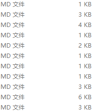

# markdown笔记 #

> 浏览公司md文档时看到的些之前没有学到的markdown编辑技巧；
> 按时间记录；

## 10/13/2017 2:47:33 PM  ##
- 插入本地相对路径的图片：
    - 
- 插入表格：

    <table>
      <tr>
        <th></th>
        <th>单程</th>
        <th>往返</th>
        <th>套班</th>
      </tr>
      <tr>
        <td>市内</td>
        <td>100元/天</td>
        <td>200元/天</td>
        <td>50元/趟</td>
      </tr>
      <tr>
        <td>省际</td>
        <td colspan="3">200元/天</td>
      </tr>
    </table>