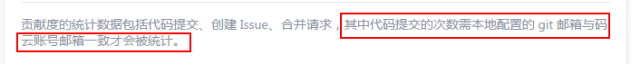

# 新工作第五天 #
> 加入新工作第五天，前面一心的惶恐没有好好思考这次新工作的意义，现在加入一周了，是时候做一个小小的反观自省；

<!--more-->

从昨天开始加入测试系统才算正式对这份新工作有点谱，感觉自己有些对这份工作主人翁的感觉。

最大的感觉是对新工作不能胜任的焦虑，十个小时的工作时间，因为这种焦虑所占用的时候应该有3个小时。但现在仔细客观地想，这种想法对现实有任何影响吗？除了造成自己内心的焦虑没有任何建设性作用。有了这份很不错的工作该做的是把这份工作提供的机会发挥利用到极致。而不是为不该担心的未来担心。这份工作提供了不少的资源，不少的学习目标可以在这儿发掘。

仔细点谈这两天的工作状态的反省。没有很好地规划好自己一天在办公室的时间。
## 合理利用好时间的安排是： ##

1. 每天早上到办公室前应该把一天的工作有个估算，进办公室把一上午的工作进行一个计划，中午吃饭时把下午的目标订好。
2. 晚上加班前把晚上加班的工作目标订好。
3. 而午饭前与晚饭前就将目标与实现的进行对比，看差在哪些地方，哪些地方需要改进，有什么变动改变了计划，下次应该怎么高效应付？
4. 每天晚上回来，将今天一天实现的东西与未实现的目标进行一次复盘，总结出下次应该怎么做可以做得更漂亮。
5. 说到底还是脱不花的“目标感”，凡事都有目标感，其他一切都先放下。

## 再谈谈工作中的人 ##
> 这些天基本把公司20左右的同事给认得脸熟了。与他们主要接触在于：一起吃饭、昨天开始测试与他们改bug要配合；但在这个过程中，我可以做得更好的，限于自己内心的焦虑，没有很好地与他们互动。

老大旭哥，很厉害的一人，家住得最远，早上却来得最早，早上一大早读马化腾与张小龙的产品文章还共享在群里，一看时间，8点不到，那个时候我想想刚起床不久。其他同事每个都有我需要学习的东西，与他们互动是我这份工作本来要做的，但我在这两天工作中并没有做好。与他们共事只有我赚的。今天中午吃完饭，与陈涛交流才发现，他的厉害之处。做事一流地在专心做事，所以才得到旭哥的常识的。

## 总结 ##
> 现在来看，这些天的工作其实可以效率更高，产出更多的。但为什么会低效而产出低呢？整个工作过程很容易带着小情绪，而情绪又恰恰是最不值钱的东西。这些情绪有时是对人，有时是对事（对未知的事情不知道怎么下手）。不满的情绪会让整个人的效率降低，整个人因为情绪的流动阻碍智商的运转。情绪对于一件工作的推动有百害而无一利，只能让人陷入自我攻击。

情绪来时或者要来时怎么办？想想自己的目标，自己是要把自己的工作往前方推动的。想想十分钟后，这件事情应该走到哪个程度？十个月后，再看这件事应该让我成长一点，应该学到点什么，应该让自己大脑沟回在哪些地方更为稳固连接？

----------
10/19/2017 1:10:32 AM 于黄金时代蜗居

*测试下带图片md文档是否能被hexo解析出正确html*
